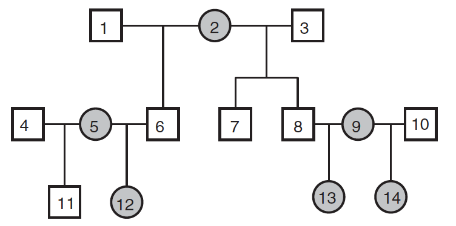
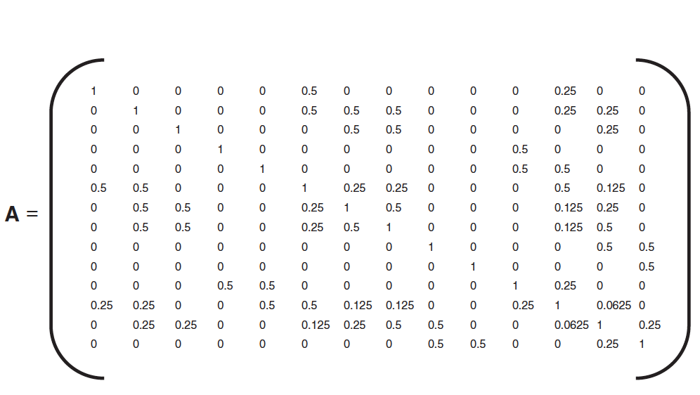

```{r setup, include=FALSE}
knitr::opts_chunk$set(echo = TRUE)
require(ape)
require(MCMCglmm)
require(brms)
```

## Quantitative genetics


- Many traits are quantitative
  - Controlled by many genes, each following Mendel's law
    - They tend to follow a normal distribution
- Environment may also play a role
- Much of this lecture is based on [Wilson _et al._ (2010)](http://www.wildanimalmodels.org/tiki-download_wiki_attachment.php?attId=22&download=y)
- The tutorial is based on [WAMWiki](http://www.wildanimalmodels.org)


## Partitioning phenotypic variance

- $V_P = V_A + V_R$, where $V_A$ is the **additive** genetic variance, and $V_R$ is the **residual (environmental)** variance
- The **narrow-sense heritability** of a trait ($h^{2}$) is then defined as $V_p$ explained by $V_P$ (i.e., $V_A/V_P$)
     - The degree of resemblance between relatives.
- For a pair of covarying traits, we can ask whether $Cov(P)$ is due to additive genetic effects $Cov(A)$
  - Genetic covariance between traits arises through linkageor pleiotropy
    - It is often expressed as a genetic correlation ($r_G$)
    - $r_G$ may constrain phenotypic evolution

## A model of an individual's breeding value

- An individual's 'breeding value' is included as an explanatory variable for a phenotypic trait of interest
- $$ y_i =  \mu + a_i + e_i $$
  - $\mu$ is the population mean
  - $i$ is the individual
  - $a_i$ is the breeding value (the effects of i’s genotype relative to $\mu$)
- However, we don't know each individual's breeding value

## Mixed-effect models 

- Random effects models can account for sources of non-independence among data points or  avoid pseudoreplication
  - Typically, if, say an individual is measured multiple times, it's id is included as a random effect
  - However, random terms allow us to make inferences about the distribution of effects in the population as a whole
    - Including identity as a random effect also yields an estimate of the among-individual variance for $y$ in the population
  - In the animal model, we treat the breeding value as 

## Animal model

- An animal model is a linear mixed effect model where the breeding
value is fitted as a random effect
- Data points are not independent, because individuals share genes
- By fitting breeding value as a random effect, we obtain an estimate of the additive genetic variance $V_A$
- In addition we can model variation from other sources (e.g., environmental, sex, etc.)
  - e.g., $y_i = \mu + sex_i + age_i + a_i + e_i$

## Pedigrees to get genetic covariance matrix {.build}





Today, these matrixes are often built using genetic data, not pedigrees.

## Tutorial: estimating heritability of birth weight {.smaller .build}

We start with simple model of birth weight in gryphons, using the `sommer` package, which has the model data set built in

```{r, message=FALSE}
library(sommer)
data(DT_gryphon)
head(DT)
dim(A)
```
- `DT` contains animal IDs
- `A` contains the matrix of relatedness

##  {.smaller .build}
```{r message=F}
mix1 <- mmer(BWT~1,
             random=~vs(ANIMAL,Gu=A),
             rcov=~units,
             data=DT,
             verbose=FALSE)
```
```{r}
summary(mix1)$varcomp
```
- `ANIMAL.BWT-BWT` is the phenotypic variance `V_P`
- `units.BWT-BWT` is the residual (unexplained) variance `V_R`

## Estimating heritability
```{r echo=F}
summary(mix1)$varcomp[1]
```
- remember $h^2  = V_A/(V_P) = V_A/(V_A + V_R)$
- $h^2$ = `r summary(mix1)$varcomp[1][1,1]` / (`r summary(mix1)$varcomp[1][1,1]` + `r summary(mix1)$varcomp[1][2,1]`) = `r summary(mix1)$varcomp[1][1,1]/(summary(mix1)$varcomp[1][1,1]+summary(mix1)$varcomp[1][2,1])`


## Covariance between traits {.smaller .build}

- One of the questions we would like to address is whether traits are independent
- This can be done by including multiple traits in the response variable

```{r}
mix2 <- mmer(cbind(BWT,TARSUS)~1,
             random=~vs(ANIMAL, Gu=A),
             rcov=~vs(units),
             na.method.Y = "include2",
             data=DT, verbose = F)
summary(mix2)$varcomp
cov2cor(mix2$sigma$`u:ANIMAL`)
```

## Best linear unbiased predictors (BLUPs) of individual breeding values {.smaller .build}

- Mixed models can allow us to solve for individual's breeding values, which software like `sommer` report (see docs for the `mmer` function.
  - These are assumed to be normally distributed
```{r fig.height=3, fig.width=3}
hist(mix1$U$`u:ANIMAL`$BWT, main = "", xlab = "")
```

## Phylogenetic models are conceptually similar {.smaller .build}

- Species are non-independent, and we can estimate the effect of phylogenetic covariance
-  We have a adata set and a phylogeny, which from which a covariance matrix is computed
```{r echo=FALSE, fig.height=4}
phylo <- ape::read.nexus("https://paul-buerkner.github.io/data/phylo.nex")
data_simple <- read.table(
  "https://paul-buerkner.github.io/data/data_simple.txt", 
  header = TRUE
)
head(data_simple, 5)
plot.phylo(phylo, show.tip.label = F)
inv.phylo <- MCMCglmm::inverseA(phylo, nodes = "TIPS", scale = TRUE)
A <- solve(inv.phylo$Ainv)
rownames(A) <- rownames(inv.phylo$Ainv)
```

--- 

- Here we use `brms`, which is Bayesian, so we should explicitly specify the priors
- The syntax is a bit different, but recognizably similar to what `sommer` does
```{r cache=T, message=F, warning=F, results=F}
model_simple <- brm(
  phen ~ cofactor + (1|phylo), data = data_simple, 
  family = gaussian(), cov_ranef = list(phylo = A),
  prior = c(
    prior(normal(0, 10), "b"),
    prior(normal(0, 50), "Intercept"),
    prior(student_t(3, 0, 20), "sd"),
    prior(student_t(3, 0, 20), "sigma")
  )
)
```

## brms results {.smaller .build}
```{r}
summary(model_simple)
```

## Computing phylogenetic signal {.smaller}
- This is roughly analagous to $h^2$ in the animal model
```{r}
hyp <- "sd_phylo__Intercept^2 / (sd_phylo__Intercept^2 + sigma^2) = 0"
(hyp <- hypothesis(model_simple, hyp, class = NULL))
plot(hyp)
```

## Other software

- As you just saw, there are many ways to actually fit these models, and you are not restricted to one kind of software
- While `sommer` is specifically designed for this type of analysis, basically any package that can fix mixed effects models can be used.
- One popular Bayesian option is `MCMCglmm`, which is relatively fast even for large data sets. However, it is farily non-user friendly, particularly when it comes to setting up priors.
- Another option is `brms`, which is easier to work with, but slower.

## Making fmore complex models {.build}

- Other matrixes can be included to model more complex processes ([Thomson et al. (2018)](https://journals.plos.org/plosone/article?id=10.1371/journal.pone.0197720))


## Exercises
1. Make models using (a) sex as a fixed effect (b) year as a random effect and (c) both effects combined.
    - How does that change the estimates of heritability? Why do you think this happens?
2. If you were to breed gryphons for body weight, which would be the best specimen?
3. Let's imagine that you didn't have BWT phenotypes for the first 100 gryphons. Can you still calculate their breeding values? 
    - Under what circumstances would this be useful?
